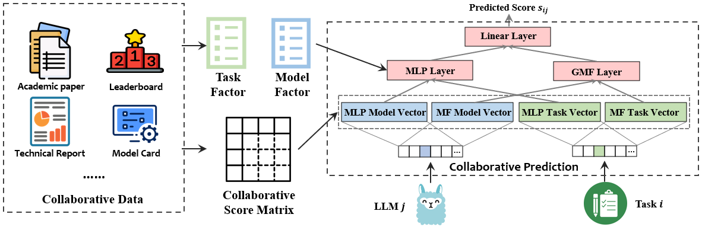

<table>
<tr>
  <td></td>
  <td><h1> Collaborative Performance Prediction for Large Language Models</h1><p>Collabrative filtering method based on collaborative performance score matrix, model factors and task factors.</p></td>
</tr>
</table>


## Description
This project introduces the Collaborative Performance Prediction (CPP) framework, which enhances the predictability of large language model (LLM) performance across various tasks. It leverages historical performance data and design factors for both models and tasks to enhance prediction accuracy, offering significant improvements over traditional scaling laws. Our framework consists of two components: 1. collaborative performance data and 2) collaborative prediction methods, for instance, Matrix Factorization, Neural Collaborative Filtering and so on. We anticipate that an accurate score can be predicted based on the historical performance of various models on downstream tasks.


## Table of Contents
- [Installation](#installation)
- [Data](#data)
- [Usage](#usage)
- [Examples](#examples)
- [API Reference](#api-reference)
- [Contributing](#contributing)
- [License](#license)
- [Citation](#citation)
- [Acknowledgments](#acknowledgments)

## Installation
```bash
# Clone the repository
git clone https://github.com/Don-Joey/CPP_LLM.git

# Navigate to the project directory
cd CPP_LLM

# Create conda environment
conda create -n CPP python=3.10

# Install dependencies
pip install -r requirements.txt
```
## Data
As the first essential component, our framework supports the use of the historical performance from open-source leaderboards such as the Open LLM leaderboard, HELM, and OpenCompass as a score matrix. The specificity of this data is that the prompt settings are consistent, the matrix density is high, and the performance scores are reliable. Here, we provide the HELM core leaderboard as a representative of this type of data []. At the same time, we also support extracting the performance of models on tasks from publicly available academic papers, technical reports, and model cards. The matrix produced by this data is characterized by lower density, but it can cover more models and downstream tasks. The variation in testing prompt settings is greater, and the performance scores may not necessarily be accurate. Additionally, we support the introduction of model factors and task factors for prediction, so we have also collected information on model factors and task factors.

### preprocess.ipynb
- **Description**: convert all tables in raw_data to the overall table all_benchmark_score.csv and all_benchmark_rank.csv.

### matric_factorization_rank.ipynb
- **Description**: train and predict rank.

### matric_factorization_score.ipynb
- **Description**: train and predict original score, then convert the score to rank.

### matric_factorization_norm_score.ipynb
- **Description**: train and predict normalized score, then convert the score to rank.
